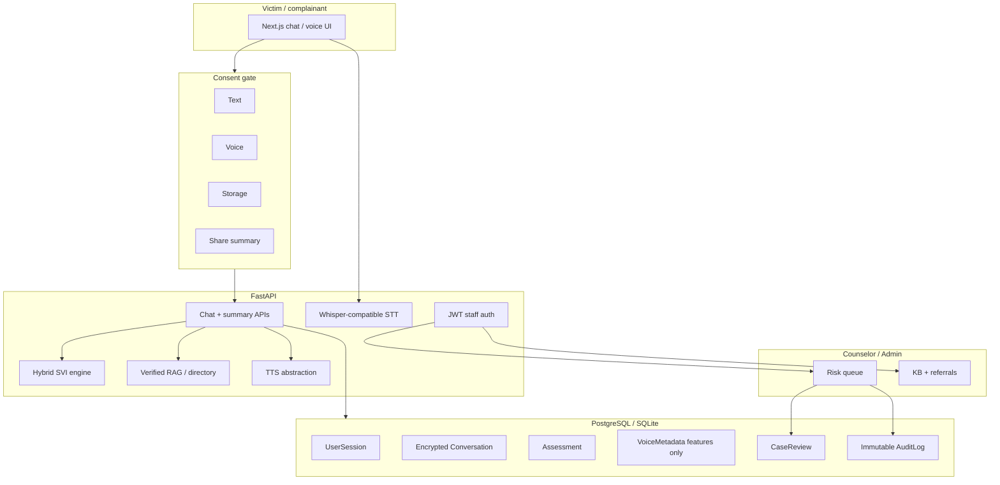

# Jolly AI (SIH26093)

Privacy-first multilingual **support and triage** chatbot for victims and complainants accessing NHAA (14566) and related pathways.

**This AI is a support and triage tool, not a medical, legal, or emergency service.** It does **not** diagnose trauma, depression, anxiety, or any mental-health condition. It does **not** automatically contact police, family, counsellors, or authorities.

Problem statement: *AI-Based Real-Time Stress and Trauma Assessment Module for Victims/Complainants Accessing NHAA (14566) and Integrated Portal.*

The git folder is `jelly-ai`; the product name is **Jolly AI**.

---

## System architecture



### Data flow

1. Landing → informed consent (text / voice / storage / sharing as **separate** flags).
2. Anonymous `UserSession` is created. No name, caste, religion, gender, disability, or location is collected as a scoring feature.
3. Chat asks only: safety, type of support sought, then free-form narration.
4. Optional browser microphone → user **corrects transcript** → optional acoustic features (rate, pauses, volume variability). Raw audio is **not** stored by default.
5. Hybrid SVI (rules + bounded voice support) returns score, band, confidence, plain-language reasons.
6. Crisis language **pauses** normal chat, offers resources, asks about immediate danger, and **requires confirmation** before any sharing.
7. User edits a summary; sharing to a case worker is opt-in.
8. Staff see consented summaries only. Aggregates are anonymized. Audit log is append-only.

---

## Folder structure

```
jelly-ai/
  backend/          FastAPI, SQLAlchemy, SVI, RAG, tests
  frontend/         Next.js App Router, Tailwind, screens
  docs/             Architecture notes, demo script, ethics
  docker-compose.yml
  .env.example
```

---

## Database schema (logical)

| Entity | Purpose |
|---|---|
| `UserSession` | Anonymous id, language, consent flags, expiry |
| `Conversation` / `Message` | Encrypted text, approved summary, retention |
| `Assessment` | SVI, band, confidence, evidence summary, human-review flag |
| `VoiceMetadata` | Consented features only — no raw audio by default |
| `Referral` | Verified/demo directory |
| `KnowledgeDoc` | Admin-managed RAG source text |
| `CaseReview` | Counselor status machine |
| `AuditLog` | Actor, action, timestamp, purpose (immutable) |
| `StaffUser` | Counselor / admin JWT login |

---

## API contract (MVP)

| Method | Path | Who | Notes |
|---|---|---|---|
| GET | `/api/health` | public | Disclaimer included |
| POST | `/api/session` | complainant | Requires `consent_text` |
| POST | `/api/chat` | complainant | Empathetic turns + optional SVI |
| POST | `/api/summary` | complainant | Approve / share |
| POST | `/api/share/confirm` | complainant | Explicit contact gate |
| GET | `/api/referrals` | public | DEMO DATA labelled |
| POST | `/api/privacy/delete` | complainant | Confirmation `DELETE` |
| POST | `/api/voice/transcribe` | complainant | Whisper URL optional |
| POST | `/api/voice/tts` | complainant | Server TTS optional |
| POST | `/api/auth/login` | staff | JWT |
| GET | `/api/staff/cases` | counselor | Consented only; `?risk=` |
| POST | `/api/staff/cases/{id}/status` | counselor | reviewed / contacted_with_consent / referred / resolved |
| GET | `/api/staff/stats` | counselor | Anonymized counts |
| CRUD-ish | `/api/admin/referrals`, `/api/admin/knowledge`, `/api/admin/audit` | admin | Directory + KB + logs |

---

## SVI scoring (pseudocode)

```
score = 0
# TEXT (identity attributes MUST NOT be inputs)
score += bounded(distress_hits)
score += bounded(fear_threat_hits)
score += bounded(isolation_hits)
score += bounded(violence_medical_hits)
score += bounded(self_harm_hits)
score += bounded(ongoing_danger_hits)
score += bounded(assistance_request_hits)
if user_says_unsafe: score += safety_weight

# VOICE — supporting only; never emotion-from-voice-alone
if voice consented and quality OK:
    score += min(12, pause + rate_deviation + variability)
else:
    mark voice_status = unavailable | low_confidence
    # do not add risk for silence / accent / disability / language

# CONVERSATION
if repeated fear/threat: score += 8
if cannot access support: score += 6

# UNCERTAINTY
if very short text and no violence/self-harm:
    confidence = Low; cap score at 49; human_review = true

# SAFETY OVERRIDE
if self_harm OR (ongoing violence) OR (unsafe AND violence/fear):
    score = max(score, 75..80); Critical; crisis_mode; human_review

risk = Low 0-24 | Moderate 25-49 | High 50-74 | Critical 75-100
return public reasons (2-4, non-stigmatizing) — hide internal hits from complainant
```

---

## Setup (local, no Docker)

You need **Python 3.11+** and **Node 20+**.

1. Copy environment placeholders:

```bash
cp .env.example .env
```

Generate a Fernet key (optional but recommended):

```bash
python -c "from cryptography.fernet import Fernet; print(Fernet.generate_key().decode())"
```

Put it in `ENCRYPTION_KEY`. If empty, the backend generates an ephemeral key (data will not survive restart decryption).

2. Backend:

```bash
cd backend
python -m venv .venv
# Windows: .venv\Scripts\activate
source .venv/bin/activate
pip install -r requirements.txt
mkdir data
set PYTHONPATH=.
uvicorn app.main:app --reload --port 8000
```

3. Frontend (new terminal):

```bash
cd frontend
npm install
npm run dev
```

Open [http://localhost:3000](http://localhost:3000).

4. Tests:

```bash
cd backend && pytest
cd frontend && npm test
```

### Demo staff logins

From `.env.example` defaults:

- Counselor: `counselor@sahara.demo` / `change-me-counselor`
- Admin: `admin@sahara.demo` / `change-me-admin`

Change these before any shared deployment.

### Docker Compose

```bash
docker compose up --build
```

Postgres, API (`:8000`), and web (`:3000`). Set secrets via environment / `.env`.

Speech: the MVP uses **browser Speech Recognition + SpeechSynthesis**. Set `WHISPER_API_URL` / `TTS_API_URL` when you have a provider. Missing voice **never** increases SVI.

---

## Required screens

| Route | Screen |
|---|---|
| `/` | Landing, mission, privacy promise, Get support |
| `/consent` | Separate voice, text, storage, sharing |
| `/chat` | Language selector, voice, emergency button |
| `/results` | Plain-language SVI suggestion |
| `/summary` | Editable, user-approved summary |
| `/staff/dashboard` | Risk queue |
| `/admin` | Knowledge base, referrals, audit |
| `/privacy` | Delete my data |

---

## Limitations and ethical safeguards

See [docs/LIMITATIONS.md](docs/LIMITATIONS.md).

Short version:

- Not a clinician, lawyer, or emergency dispatcher.
- RAG answers come only from seeded/admin documents; many contacts are **DEMO DATA** until verified.
- Conservative when uncertain; human review is recommended rather than a strong claim.
- No auto-notification of authorities.
- Works fully in text-only mode.

---

## 5-minute SIH demo script

See [docs/DEMO_SCRIPT.md](docs/DEMO_SCRIPT.md).
