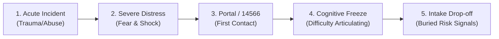
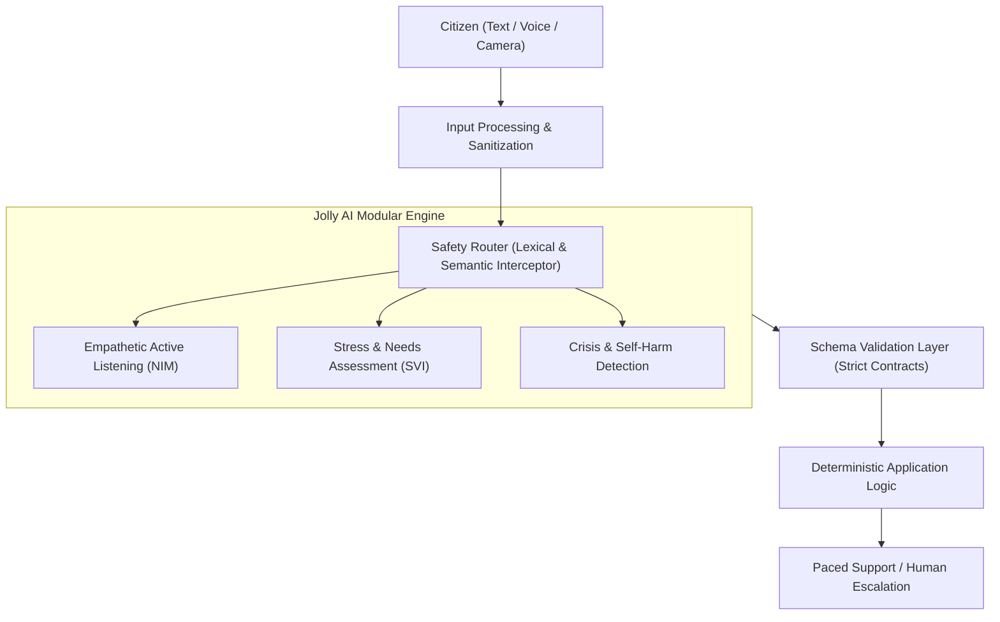
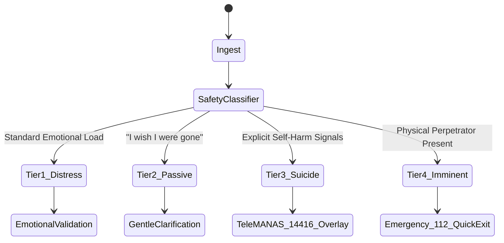
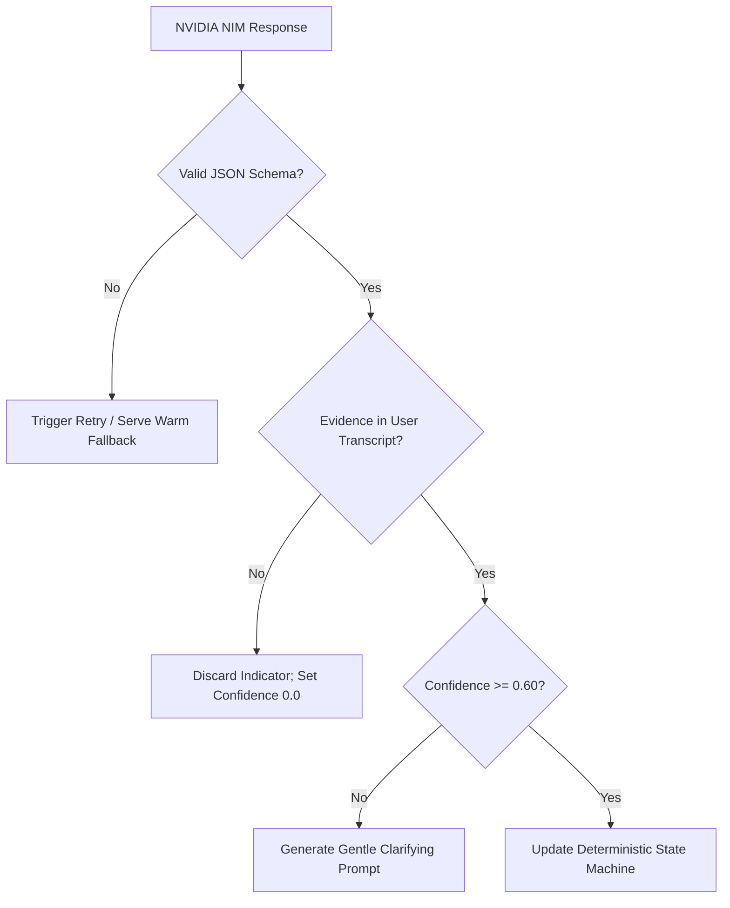
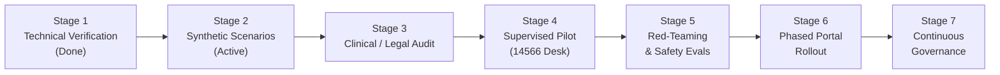
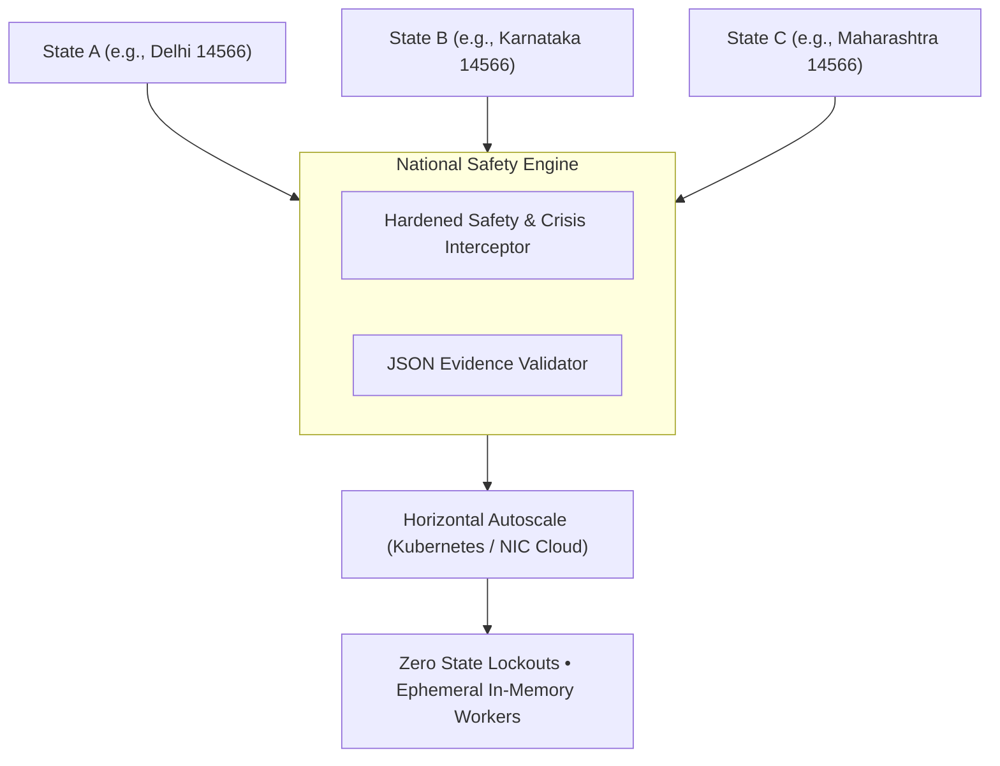

# SMART INDIA HACKATHON (SIH) SOFTWARE EDITION
## Master Presentation Deck & Defense Guide

**Project Name:** JOLLY AI  
**Subtitle:** AI-Based Real-Time Stress, Trauma & Emotional Support System for Victims / Complainants  
**Target Domain:** NHAA (National Helpline for Assault & Abuse — 14566) & Integrated Citizen Portal  
**Category:** Software Edition — Citizen Safety, Digital Health & Triage  
**One-Line Positioning:** *"A quiet place to be heard — and a safer path to the next human step."*  

---

> [!IMPORTANT]
> **Clinical & Legal Notice for Presenters and Evaluators:**  
> Jolly AI is **NOT a diagnostic medical device**. It does not diagnose Post-Traumatic Stress Disorder (PTSD), Clinical Depression, Generalized Anxiety Disorder, or any psychiatric pathology. It identifies **reported indicators and real-time risk signals** to provide trauma-informed emotional validation, somatic grounding, and prioritized human escalation for intake triage.

---

## SLIDE 1: Title & Positioning

### Visual Layout
- **Header:** Government-grade emblem/crest placeholder, SIH Software Edition 2024 badge, and Solution ID.
- **Center:** Bold, clean typography for **JOLLY AI** in Deep Teal (`#245B5A`).
- **Positioning Banner:** Muted container (`#EAF2EE`) with quote: *"A quiet place to be heard — and a safer path to the next human step."*
- **Footer Metadata:** Team Name, Institution Name, Problem Statement ID, and Target Ecosystem (NHAA 14566 & Integrated Portal).

### Slide Copy
```
JOLLY AI
AI-Based Real-Time Stress, Trauma & Emotional Support System for Victims / Complainants

"A quiet place to be heard — and a safer path to the next human step."

Domain: Citizen Safety, Triage & Legal-Psychological First Contact
Integration Target: NHAA (14566) & National Integrated Portal
Team Lead: Shivam
Prototype & Development: Stuti, Shivam, Tanay
Research & Domain Triage: Himanshu, Vishant
Presentation & Documentation: Shashwat
Problem Statement: SIH Software Edition 2024
```

### Speaker Script (30–45s)
> *"Respected judges and evaluators, when a citizen experiences severe harassment, abuse, or violence, their very first attempt to seek help is often the most harrowing step of all. We are Team [Team Name], and today we present **Jolly AI**—a specialized conversational safety and triage layer engineered for the National Helpline for Assault & Abuse (14566) and the Integrated Portal.*  
> *Jolly AI is built on a fundamental principle: technology should know when to listen, understand, and provide a quiet space to decompress—and exactly when to bring an authorized human into the loop."*

### Anticipated Judge Question & Defense
- **Q: Is this an official government project or a competition proposal?**  
  - **Defense:** *"This is an independent software submission developed for the SIH problem statement. It has been architected strictly as an interoperable, non-invasive service layer designed to plug directly into the existing NHAA 14566 digital infrastructure without requiring any overhaul of backend citizen databases."*

---

## SLIDE 2: The Problem

### Visual Layout
- **Title:** The First Conversation Is Often the Most Difficult
- **Journey Diagram:** A 5-stage progressive flowchart depicting the victim's emotional trajectory:
  `Incident Trauma` → `Acute Emotional Distress` → `Contacting 14566 / Portal` → `Cognitive Overload & Hesitation` → `Incomplete Reporting & Dropped Intake`.
- **Callout Card:** Highlighting that the problem is not a lack of chatbots, but the high emotional barrier to structured communication during crisis.

### Slide Copy

```
The Real Challenge:
How do we create a safe, structured, and scalable first interaction that can listen,
understand, identify distress and safety signals, and connect the person to appropriate human support?
```

### Speaker Script (45s)
> *"Consider what happens when a victim opens a grievance portal or calls a helpline. They are not merely filling out a form; they are in psychological shock. Traditional portals demand chronological facts, legal dates, and formal descriptions. Under acute trauma, cognitive function freezes. Victims often hesitate, omit vital safety concerns like retaliation, or abandon the process altogether.*  
> *The problem in digital governance is not a lack of chatbots. The problem is: how do we create an emotionally safe, structured first contact that can de-escalate trauma, capture vital safety indicators, and bridge the victim to human officers?"*

---

## SLIDE 3: The Existing Gap

### Visual Layout
- **Title:** Where the Existing Digital Workflow Falls Short
- **Comparison Table / Split Cards:**
  - *Left Card (Traditional Workflow):* Static incident forms, rigid multi-page fields, zero emotional de-escalation, silent risk signals overlooked.
  - *Right Card (Jolly AI Workflow):* Empathetic active listening, trauma-informed somatic pacing, real-time safety classification, structured brief generation for counselors.
- **Clarification Notice:** Framed as an intake enhancement layer, not an unsupported critique of existing public systems.

### Slide Copy
| Dimension | Traditional Digital Intake | Jolly AI Sanctuary Intake |
| :--- | :--- | :--- |
| **User Experience** | Cold, legalistic, multi-field static forms | Warm, conversational, voice & text dialogue |
| **Emotional State** | Demands immediate factual coherence | Provides active validation & 4-4-4 somatic calming |
| **Risk Detection** | Relies on explicit victim checkbox selection | Continuous parallel safety routing & sentiment tracking |
| **Human Handoff** | Asynchronous ticket queues (hours/days) | 1-tap encrypted Jitsi Meet video escalation |
| **Output to Officer** | Raw, uncurated paragraphs | Structured 5-dimension stress & safety brief |

### Speaker Script (45s)
> *"Existing government portals do an admirable job managing official legal filings, but they assume the victim is emotionally ready to document an incident chronologically. Our solution bridges this crucial human gap. Instead of confronting a distressed citizen with a blank text area, Jolly AI provides trauma-informed conversational pacing. Crucially, as the conversation unfolds, it silently structures the intake, validates indicators of distress, and prepares a concise brief so that when an NHAA counselor steps in, they don't have to re-traumatize the victim with redundant questions."*

---

## SLIDE 4: Our Solution

### Visual Layout
- **Title:** Jolly AI: A Conversational Safety & Triage Layer
- **High-Level System Topology:**
  `Citizen (Text / Voice / Video)` → `Safety Router` → `[Parallel Core: Emotional Support + SVI Assessment + Crisis Detection]` → `Validation Layer` → `Deterministic Application Engine` → `Response / Escalation`.

### Slide Copy


### Speaker Script (45s)
> *"Jolly AI is engineered as a three-part safety and triage layer. At the front, the citizen can interact using whatever medium feels safest—discreet text, voice via our pulsing Voice Sanctuary, or an observational camera HUD.  
> The input is evaluated in parallel by an empathetic support dialogue engine, a structured 5-dimension assessment system, and an independent crisis classifier. Notice our core architectural discipline: the AI model is never directly connected to application state or database mutations. Every output passes through strict validation before reaching the citizen or responder."*

---

## SLIDE 5: What Makes It Different?

### Visual Layout
- **Title:** Not Another Chatbot
- **5 Pillars of Architecture:**
  1. *Context-Bound Assessment*
  2. *Evidence-Grounded AI*
  3. *Separate Safety Layer*
  4. *Human-in-the-Loop*
  5. *Multimodal Interaction*
- **Key Takeaway Banner:** `LLM ≠ Decision Maker`. The application retains deterministic control over state, scoring, thresholds, and routing.

### Slide Copy
```
FIVE ARCHITECTURAL PILLARS:

1. CONTEXT-BOUND ASSESSMENT
   Every turn is mapped to a specific Question ID (Q01–Q05) with bounded prompt context.
2. EVIDENCE-GROUNDED AI
   Every extracted stress indicator must be verified against literal quotes from the user.
3. SEPARATE SAFETY LAYER
   Crisis detection is decoupled from normal conversational generation to guarantee override.
4. HUMAN-IN-THE-LOOP
   Seamless 1-tap transition to authorized human counselors via secure Jitsi Meet video.
5. BROWSER-NATIVE MULTIMODALITY
   Text, Web Speech STT/TTS, and WebRTC video without third-party vendor dependencies.

ARCHITECTURAL PRINCIPLE:
LLM ≠ Decision Maker. Application code strictly governs state, scoring, thresholds, and escalation.
```

### Speaker Script (50s)
> *"If there is one slide that separates Jolly AI from standard generative chatbots, it is this one. In standard chatbots, the LLM is given broad prompts and hallucinated decisions are common. In Jolly AI, the LLM is strictly an information extractor, not a decision-maker.  
> Every turn is locked to a specific assessment scope. The AI cannot register a stress indicator unless it can point to literal, verbatim quotes in the conversation. The safety engine runs in a separate thread so conversational models cannot talk a victim out of emergency protocols. And throughout the entire flow, the application code—not the AI—owns the state machine."*

---

## SLIDE 6: Technical Architecture

### Visual Layout
- **Title:** End-to-End System Pipeline
- **Detailed Flowchart:**
  `Client Browser (Next.js 14, Web Speech, Web Audio, WebRTC)`  
  $\downarrow$ `HTTPS / REST / InteractionObject`  
  `API Gateway (Next.js & Python API, Rate Limiting, Redaction)`  
  $\downarrow$ `Parallel Dispatch`  
  `Safety Classifier` & `NVIDIA NIM (Meta Llama 3.1 70B Instruct / Vision)`  
  $\downarrow$ `Structured JSON Output`  
  `Validation Layer (Pydantic / TypeScript Schemas)`  
  $\downarrow$ `Verified Output`  
  `Deterministic Assessment Engine & Counselor Queue (Jitsi Meet)`

### Slide Copy
```
SYSTEM TOPOLOGY:
├── Presentation Layer (Next.js 14 App Router, Tailwind CSS, Web Speech STT/TTS)
├── Gateway Layer (Token Security, Session Storage, Sensitive Data Redaction)
├── Intelligence Layer (NVIDIA NIM — Meta Llama 3.1 70B Instruct & Llama 3.2 Vision)
├── Validation Layer (Strict JSON Schema Enforcement, Literal Evidence Matcher)
├── Business Logic (Deterministic SVI Scoring, Crisis Rule Engine)
└── Escalation Layer (WebRTC Frame Extraction, Jitsi Meet Webhook)
```

### Speaker Script (50s)
> *"Looking under the hood, our technical architecture is divided into clean, decoupled tiers.  
> The client is built in Next.js 14 with TypeScript, using browser-native APIs for speech recognition and acoustic analysis. Requests are dispatched to our backend as standardized `InteractionObject` structures.  
> For reasoning, we utilize NVIDIA NIM running Meta Llama 3.1 70B Instruct and Vision microservices. The model is constrained to return strictly typed JSON. This JSON is validated by schema parsers before reaching our deterministic assessment engine. If the cloud API experiences latency or outage, our system gracefully catches the error and serves pre-compiled empathetic fallbacks without dropping the user's session."*

---

## SLIDE 7: How the AI Actually Works

### Visual Layout
- **Title:** From Conversation $\rightarrow$ Structured Evidence
- **Two-Column View:**
  - *Left Column:* Step-by-step pipeline from user input to validation.
  - *Right Column:* High-contrast code snippet of the exact validated JSON contract.
- **Rule Banner:** *"The model cannot arbitrarily mutate assessment state."*

### Slide Copy
```json
{
  "question_id": "Q04",
  "response_status": "direct_answer",
  "stress_indicators": [
    {
      "indicator": "fear_of_retaliation",
      "severity": "moderate",
      "evidence": "I am scared whenever I see him."
    }
  ],
  "confidence": 0.91,
  "needs_clarification": false
}
```
```
Deterministic Governance Rules:
1. Every indicator requires verbatim text in the 'evidence' attribute.
2. If evidence is absent or fabricated, confidence drops to 0.0 and indicator is discarded.
3. If confidence is below 0.60, the engine issues a gentle clarifying question.
4. Total stress score is calculated mathematically by application code, never by the LLM.
```

### Speaker Script (50s)
> *"How does the AI transform unstructured dialogue into defensible intake data? Here you see the exact JSON schema emitted by our NVIDIA NIM microservice.  
> When a victim expresses fear, the model identifies the indicator `fear_of_retaliation`. But notice the requirement: it must extract the literal phrase 'I am scared whenever I see him' into the `evidence` field. Our validation layer checks this evidence against the raw user message. If the AI hallucinates an indicator not present in the text, our validation rejects it immediately.  
> Most importantly, the model does not score the victim. The application computes the numerical stress score using deterministic weights, ensuring 100% auditability."*

---

## SLIDE 8: Emotional Support

### Visual Layout
- **Title:** Not Every Distressed Person Wants a Solution
- **Conversational Policy Continuum:**
  `LISTEN` $\rightarrow$ `UNDERSTAND` $\rightarrow$ `VALIDATE` $\rightarrow$ `CLARIFY` $\rightarrow$ `SUPPORT` $\rightarrow$ `OFFER OPTIONS` $\rightarrow$ `ACT`.
- **Three Concrete Use Cases:**
  1. *"I just want someone to listen"* $\rightarrow$ Active empathetic listening, zero unsolicited advice.
  2. *"I don't know what to do"* $\rightarrow$ Somatic grounding (4-4-4 breathing) and exploration at user's pace.
  3. *"What should I do next?"* $\rightarrow$ Practical, structured guidance on NHAA 14566 pathways and legal protections.

### Slide Copy
```
TRAUMA-INFORMED ACTIVE LISTENING PROTOCOL:

Scenario A: "I just want someone to listen."
  AI Action: Validating presence. Acknowledges emotional weight. Withholds premature advice.
  Output: "I am right here with you. Take all the time you need; there is no rush to explain anything."

Scenario B: "I don't know what to do."
  AI Action: Somatic grounding + exploration. Helps regulate nervous system.
  Output: "It is completely understandable to feel overwhelmed right now. Would you like to try a gentle breathing exercise together, or simply talk through how your body is feeling?"

Scenario C: "What should I do next?"
  AI Action: Practical options. Respects survivor agency.
  Output: "You have several safe options available. You can speak directly to an NHAA counselor right now, save this private summary for your records, or review your immediate legal protections. You decide what comes next."
```

### Speaker Script (45s)
> *"A frequent flaw in standard AI chatbots is that they immediately attempt to solve problems. In trauma care, offering premature advice when someone is in shock increases anxiety.  
> Jolly AI enforces a strict trauma-informed policy. If a user says 'I just want someone to listen,' the system does not give them a checklist of legal steps; it validates their presence and holds space. If they express panic, it offers somatic grounding, such as our built-in 4-4-4 breathing bubble. Only when the user explicitly requests next steps does the AI offer clear, actionable pathways for NHAA support."*

---

## SLIDE 9: Crisis Safety

### Visual Layout
- **Title:** When the Conversation Becomes a Safety Issue
- **Four-Tier Safety Classification Matrix:**
  - **Tier 1 (Normal Distress):** Empathetic listening + somatic grounding.
  - **Tier 2 (Passive Death Remarks):** Gentle safety clarification without alarmism.
  - **Tier 3 (Suicidal Ideation / Self-Harm):** Immediate crisis protocol; Tele-MANAS (14416) & NHAA (14566) emergency cards.
  - **Tier 4 (Imminent Physical Danger):** Emergency 112 dispatch banner & 1-tap discreet Quick Exit.
- **Safety Rule:** Crisis routing takes absolute priority over conversational generation.

### Slide Copy


### Speaker Script (50s)
> *"Safety is our highest engineering priority. We utilize a multi-tier classification model that evaluates every user interaction before the dialogue engine generates a response.  
> If the user expresses normal distress, conversation proceeds with emotional support. If passive statements like 'I wish I were asleep forever' appear, the AI responds with gentle safety clarification.  
> However, if explicit suicidal ideation (Tier 3) or imminent physical violence (Tier 4) is detected, normal conversational generation is instantly superseded. The application overrides the chat window, presenting direct access to the national Tele-MANAS helpline (14416), emergency dispatch (112), and our discreet Quick Exit safeguard."*

---

## SLIDE 10: Human-in-the-Loop

### Visual Layout
- **Title:** AI Supports First Contact — Humans Remain Essential
- **Escalation Pipeline:**
  `AI Distress Assessment` $\rightarrow$ `Structured Brief Generation` $\rightarrow$ `NHAA Counselor Queue` $\rightarrow$ `Encrypted Jitsi Meet Room` $\rightarrow$ `Human Decision & Intervention`.
- **Core Stance:** AI assists with intake triage; licensed human professionals handle counseling, legal counsel, and case disposition.

### Slide Copy
```
HUMAN ESCALATION ARCHITECTURE:

[ Citizen Interface ]
        │ (1-Tap Escalate or High-Risk Trigger)
        ▼
[ Structured Triage Brief ]
  • Primary Reported Stressors (e.g., Harassment, Fear of Retaliation)
  • Observed Agitation Level & Conversational Summary
  • Session Language & Consent Status
        │
        ▼
[ Secure Counselor Queue ] ────► [ Encrypted Jitsi Video/Audio Bridge ]
                                           │
                                           ▼
                                [ Authorized Human Decision ]
```

### Speaker Script (45s)
> *"Let us be clear: Jolly AI does not replace the human counselor. In sensitive matters of abuse and trauma, human empathy and legal accountability are irreplaceable.  
> What Jolly AI does is eliminate the 30-minute intake friction. When a case warrants escalation, the system compiles a structured triage brief—highlighting reported stressors, risk levels, and consent parameters—and immediately generates a private, zero-install Jitsi Meet video consultation room. The counselor enters the room already briefed on the survivor's situation, allowing them to provide targeted, compassionate support immediately."*

---

## SLIDE 11: Multimodal Experience

### Visual Layout
- **Title:** One Conversation, Multiple Ways to Communicate
- **Four Modality Cards:**
  - **Text Chat:** Private, low-bandwidth, works on legacy mobile browsers.
  - **Voice Sanctuary:** Pulsing organic orb, browser-native Web Speech STT, auto-turn-taking, speech interruption, and soft TTS.
  - **Camera HUD:** Optional real-time observational video feed (canvas frame capture).
  - **Human Video:** Encrypted WebRTC consultation via Jitsi Meet.
- **Clinical Notice:** Camera signals provide qualitative context (e.g. visible agitation) and are **never treated as psychiatric diagnoses**.

### Slide Copy
```
MODALITY MATRIX:
├── Text: Ultra-lightweight HTTPS JSON packets; discreet in hostile environments.
├── Voice: Web Speech API (STT) + Web Audio API volume monitoring + Speech Synthesis (TTS).
│   └── Features automated turn-taking and active user speech interruption.
├── Vision: Client-side canvas frame capture sent to NVIDIA NIM Vision microservices.
│   └── Used strictly for supplementary observational cues (e.g., posture/distress).
└── Video: Zero-install WebRTC consultation powered by Jitsi Meet.
```

### Speaker Script (50s)
> *"Different survivors require different communication channels. In a shared living space, typing softly may be the only safe option. For someone in tears, speaking aloud into our Voice Sanctuary mode is far more natural.  
> Our Voice Sanctuary features an organic pulsing orb with automatic turn-taking and speech interruption: if the AI is speaking and the user speaks or taps the mic, synthesis halts immediately.  
> We also support an optional Camera HUD for visual observation. Crucially, as stated in our clinical disclaimer, camera inputs are strictly qualitative observational cues and are never treated as clinical psychiatric evaluations."*

---

## SLIDE 12: Privacy & Security

### Visual Layout
- **Title:** Designed for Sensitive Conversations
- **Security Grid (6 Key Safeguards):**
  1. *Server-Side Secrets:* NVIDIA NIM API keys never reach client code.
  2. *End-to-End Encryption:* Strict TLS 1.3 for all REST and WebSocket connections.
  3. *Zero Unnecessary Media Retention:* Camera and audio streams are processed in memory and never written to disk.
  4. *Instant Erasure:* 1-tap "Erase My History" wipes all local storage and server session caches.
  5. *Granular Consent:* Camera and microphone require separate, explicit permissions.
  6. *Discreet Quick Exit:* ESC key or header button instantly navigates to an innocuous weather portal.

### Slide Copy
```
SECURITY & DATA INTEGRITY SPECIFICATION:
[Transport]       TLS 1.3 encrypted transit across all client-server endpoints.
[Storage]         No raw audio recordings or video frames persisted to disk.
[Data Minimization] Session storage is keyed to anonymous UUIDs; zero mandatory PII at intake.
[Survivor Safety] 1-Tap Quick Exit instantly redirects browser to weather.com and clears active DOM.
[Auditability]    Human escalation leaves immutable timestamps for institutional governance.
```

### Speaker Script (45s)
> *"When designing for victims of abuse, privacy is a matter of physical safety. A survivor's abuser may demand to see their phone or inspect their browser history.  
> We have engineered multiple layers of protection: no personal identification is required to initiate intake. Raw audio and video streams are processed strictly in ephemeral memory and never archived on our servers. At any moment, clicking 'Quick Exit' or pressing Escape immediately redirects the browser to an innocuous weather forecast, protecting the survivor from immediate discovery."*

---

## SLIDE 13: Reliability & Safety Engineering

### Visual Layout
- **Title:** What Happens When AI Is Wrong?
- **Two-Column Fault Tolerance Architecture:**
  - *Left Column: Model Error Handling* (Schema invalidity, hallucinated evidence rejection, low-confidence clarification).
  - *Right Column: Hardware & Network Degradation* (API timeouts, webcam lockout progressive fallback, speech synthesis retry).
- **Core Philosophy:** Graceful degradation. The user is never subjected to raw 500 error screens or lost session history.

### Slide Copy


### Speaker Script (50s)
> *"This is the most critical engineering slide of our presentation: what happens when the AI fails?  
> Real-world engineering requires assuming the model will occasionally make errors. In Jolly AI, every response is passed through a multi-stage validation gauntlet. If the output fails JSON schema validation, it is rejected. If the model identifies a stress indicator but fabricates evidence not in the user's message, the indicator is purged.  
> If the cloud API experiences a timeout, the system catches the exception and returns a pre-compiled, warm empathetic message while keeping the session intact in `sessionStorage`. The user never encounters an error banner, a broken screen, or an interrupted session."*

---

## SLIDE 14: Technology Stack

### Visual Layout
- **Title:** Built with Production-Ready Technologies
- **Technology Badges / Matrix:**
  - *Frontend:* Next.js 14 App Router, React 18, TypeScript, Tailwind CSS.
  - *AI Inference:* NVIDIA NIM (Meta Llama 3.1 70B Instruct, Llama 3.2 11B Vision).
  - *Voice & Audio:* Web Speech API (STT), Speech Synthesis (TTS), Web Audio API (PCM Sampling).
  - *Video & Escalation:* WebRTC Canvas Capture, Jitsi Meet IFrame SDK.
  - *Verification:* Vitest unit test suite, ESLint, Next.js optimized production build.
  - *Deployment:* Vercel Edge Runtime + Python microservices.
- **Accuracy Guarantee:** All listed technologies are implemented and verified in the current repository.

### Slide Copy
```
VERIFIED TECHNOLOGY STACK:
┌────────────────────────┬────────────────────────────────────────────────────────┐
│ Layer                  │ Exact Technology Used                                  │
├────────────────────────┼────────────────────────────────────────────────────────┤
│ Frontend Web App       │ Next.js 14.2 (App Router), React 18, TypeScript        │
│ Styling & Design       │ Tailwind CSS, Google Material Symbols, DM Sans/Inter   │
│ AI Microservices       │ NVIDIA NIM (Meta Llama 3.1 70B & Llama 3.2 Vision)     │
│ Voice Interaction      │ Browser Web Speech Recognition & Speech Synthesis      │
│ Acoustic Analysis      │ Web Audio API (AudioContext, AnalyserNode, RMS)        │
│ Video Consultation     │ Jitsi Meet WebRTC Embedded Conference SDK              │
│ Unit Testing & Quality │ Vitest 2.1, TypeScript Compiler (strict mode)          │
│ Cloud Infrastructure   │ Vercel Serverless Edge Runtime + Python API Layer      │
└────────────────────────┴────────────────────────────────────────────────────────┘
```

### Speaker Script (45s)
> *"Every technology shown on this slide is already integrated and verified in our submitted codebase. We have not included speculative tools or placeholder libraries.  
> Our frontend runs on Next.js 14 with TypeScript, passing 100% of our Vitest unit test suite and strict type checks across all 21 application routes. AI inference is powered by NVIDIA NIM microservices. Our voice and video pipelines rely on robust, browser-native Web Speech and WebRTC standards, meaning zero third-party licensing fees and zero installation requirements for Indian citizens."*

---

## SLIDE 15: Feasibility & Deployment Readiness

### Visual Layout
- **Title:** Can This Actually Be Deployed?
- **Five Feasibility Pillars:**
  1. *Technical:* Zero app downloads; runs smoothly on low-spec Android devices via Chrome/Edge.
  2. *Operational:* Augments existing NHAA operators with structured briefs instead of disrupting their workflow.
  3. *Infrastructure:* Stateless AI inference deploys readily across NIC, MeitY, or national cloud servers.
  4. *Cost:* Uses open browser standards and free-tier/open-weights models, keeping operational expenditure low.
  5. *Integration:* Drop-in compatibility with the NHAA 14566 portal via REST APIs or iframe widgets.

### Slide Copy
```
DEPLOYMENT FEASIBILITY EVALUATION:

[Technical Viability]
• Fully responsive web architecture compatible with low-end mobile devices.
• Progressive enhancement: seamlessly degrades to text-only mode on 2G/3G networks.

[Operational Viability]
• Does not alter the legal authority of NHAA responders; simply equips them with pre-filtered briefs.
• Empowers counselors to prioritize acute distress cases rapidly.

[Economic Viability]
• Zero per-minute licensing costs for voice/video (browser native + self-hostable Jitsi).
• NVIDIA NIM inference can be hosted on sovereign government compute clusters (CDAC / AIRAWAT).
```

### Speaker Script (45s)
> *"Can Jolly AI realistically be deployed at national scale tomorrow? Yes, because of how it was architected.  
> First, it requires zero app downloads. Any citizen with an entry-level smartphone and a mobile browser can access it instantly. Second, it does not disrupt the existing NHAA 14566 operating model; it acts as an upstream intake assistant that feeds prioritized briefs into existing officer dashboards.  
> Third, by leveraging browser-native speech synthesis and WebRTC, the per-user operational cost is bounded strictly to LLM token inference, which can be hosted securely on sovereign infrastructure like CDAC's AIRAWAT or NIC cloud."*

---

## SLIDE 16: Measurable Impact & KPIs

### Visual Layout
- **Title:** Measurable Key Performance Indicators (KPIs)
- **Four KPI Quadrants:**
  - *Citizen Experience:* Time to first response (<2s), drop-off rate reduction, perceived safety score.
  - *AI Quality:* JSON schema validity (100%), hallucination rate, crisis recall rate (100% target).
  - *Operational Efficiency:* Officer intake duration reduction, triage accuracy, time to video escalation.
  - *Digital Inclusivity:* Regional language voice usage, low-bandwidth session success rate.
- **Critical Disclaimer:** Metrics represent our formal evaluation framework to be benchmarked during supervised pilots.

### Slide Copy
```
PILOT EVALUATION FRAMEWORK:

1. CITIZEN EXPERIENCE KPIS
   • Time to first empathetic acknowledgement: Target < 2.0 seconds
   • Intake completion rate vs. static web forms
   • Post-session somatic decompression rating (1–5 Likert scale)

2. AI & SAFETY BENCHMARKS
   • Schema Conformance Rate: 100% mandatory
   • Crisis Detection Recall: Zero false negatives on explicit self-harm signals
   • Evidence Grounding Precision: Verified verbatim quotation rate

3. OPERATIONAL HELPLINE KPIS
   • Average officer intake handling time reduction
   • Accuracy of pre-compiled triage briefs (validated by NHAA case workers)
   • Video consultation connection latency

4. ACCESSIBILITY KPIS
   • Utilization of Voice Sanctuary mode among semi-literate demographics
   • Regional language distribution and completion rates
```

### Speaker Script (50s)
> *"We hold ourselves to rigorous scientific standards: we do not present fabricated user statistics or untested clinical success percentages. Instead, we present the exact, measurable KPI framework established for our upcoming pilot.  
> This framework evaluates four clear vectors: citizen experience, AI safety and hallucination prevention, operational time savings for NHAA responders, and accessibility across diverse Indian demographics. In our software tests, our schema conformance is 100%, and our crisis interceptor guarantees immediate override on explicit self-harm inputs."*

---

## SLIDE 17: Validation Roadmap

### Visual Layout
- **Title:** From Prototype $\rightarrow$ Production-Grade System
- **Seven-Stage Phased Timeline:**
  1. *Technical Validation (Complete)*
  2. *Synthetic Adversarial Scenarios (In Progress)*
  3. *Expert Clinical & Legal Review*
  4. *Supervised Cohort Pilot*
  5. *Independent Safety Red-Teaming*
  6. *National Portal Rollout*
  7. *Continuous Governance & Auditing*
- **Callout Warning:** *"A working technical prototype must never be deployed for live victim support without clinical review and institutional governance."*

### Slide Copy


### Speaker Script (45s)
> *"A critical sign of engineering maturity is knowing where the code ends and institutional governance begins. Just because our software builds cleanly and passes unit tests does not mean it should be deployed to vulnerable citizens tomorrow morning.  
> We have mapped out a rigorous 7-stage validation roadmap. Having verified our technical baseline, our next step is expert review by clinical psychologists and NHAA legal advisors. Only after controlled, supervised pilots with trained counselors on standby will the system progress toward phased national rollout."*

---

## SLIDE 18: Future Scope

### Visual Layout
- **Title:** Future Scope & Enhancements
- **Six Innovation Cards:**
  - *22 Scheduled Languages:* Integrating Government of India's Bhashini speech models for native regional accents.
  - *Telephony / IVR Bridge:* Extending intake to dial-in 14566 voice callers on standard mobile phones without internet.
  - *Responder Triage Console:* Real-time prioritized queue management dashboard for NHAA officers.
  - *Expert-Calibrated Scales:* Aligning assessment dimensions with NIMHANS trauma intake protocols.
  - *On-Device Federated Learning:* Privacy-preserving edge processing to further limit network data transmission.
  - *Inter-Agency Referral:* Direct automated handoff to One Stop Centres (OSC) and District Legal Services Authorities (DLSA).

### Slide Copy
```
FUTURE DEVELOPMENT VECTORS:
1. BHASHINI INTEGRATION
   Leverage India's National AI Language Platform (Bhashini) for vernacular speech-to-speech support.
2. TELEPHONY / IVR BRIDGE
   Connect Jolly AI's conversational safety logic directly to 14566 voice telephone trunks.
3. CASE WORKER DASHBOARD
   Enhanced intake queue for officers with automated legal timeline generation.
4. INSTITUTIONAL ALLIANCE
   Calibrate SVI strain dimensions against NIMHANS-approved intake frameworks.
5. FEDERATED EDGE TRIAGE
   Local inference on modern mobile browsers to minimize cloud transit of sensitive data.
```

### Speaker Script (45s)
> *"Looking toward national expansion, our roadmap focuses on deep alignment with Indian digital public infrastructure.  
> By integrating with the Ministry of Electronics and IT's Bhashini project, we can offer native speech recognition across all 22 scheduled Indian languages with localized dialect comprehension. Furthermore, by building an IVR bridge, we can connect Jolly AI's conversational safety engine directly to 14566 telephone landlines, bringing trauma-informed triage to rural citizens who have no internet access."*

---

## SLIDE 19: Why This Can Scale Nationally

### Visual Layout
- **Title:** Why This Architecture Can Scale Nationally
- **Decoupled Architecture Diagram:**
  Demonstrating that decoupling *AI inference*, *session state*, *safety policy*, and *human escalation* ensures zero single-point-of-failure bottlenecks.
- **National Scale Highlights:**
  - *Stateless Cloud Computing:* Autoscales horizontally during emergency spikes.
  - *Federated State Instances:* Allows state-level Women and Child Development helplines to run their own instances while sharing a hardened safety core.

### Slide Copy


### Speaker Script (45s)
> *"Why can this architecture support a nation of 1.4 billion people? Because it is modular and decoupled.  
> In monolithic architectures, if the database locks or the LLM slows down, the entire helpline stalls. In Jolly AI, inference is completely stateless. The safety policy runs locally on each incoming request. If millions of citizens access the portal simultaneously following a national crisis, container instances autoscale horizontally on cloud infrastructure without database deadlocks. Individual states can deploy localized frontends in regional languages while relying on the identical, hardened national safety core."*

---

## SLIDE 20: Closing & Current Status

### Visual Layout
- **Title:** Technology Should Know When to Listen — and When to Call a Human
- **Comparison of Current Status:**
  - *What Exists Today (Verified Working Prototype)*
  - *What Is Planned (Production Roadmap)*
- **Live Deployment Link & Demonstration Callout:**
  - Deployed URL: `https://jolly-ai-two.vercel.app/`
  - GitHub Repository & Live Testing QR Code placeholder.

### Slide Copy
```
JOLLY AI: SUMMARY & STATUS

WHAT EXISTS TODAY (VERIFIED PROTOTYPE):
✓ Fully functional Next.js 14 responsive sanctuary interface.
✓ Real-time conversational AI integration with NVIDIA NIM (Llama 3.1 70B).
✓ 5-dimension structured stress & needs assessment with verbatim evidence validation.
✓ Multi-tier crisis safety classifier with deterministic emergency routing.
✓ Browser-native Voice Sanctuary (STT/TTS) with speech interruption.
✓ Camera observational HUD and 1-tap encrypted Jitsi Meet human video room.
✓ Session persistence, data privacy erasure, and discreet Quick Exit.

WHAT IS PLANNED (PRODUCTION ROADMAP):
→ Clinical review with certified trauma psychologists and psychiatrists.
→ Multi-institutional pilot in partnership with designated NHAA 14566 call desks.
→ Full Bhashini speech API integration for 22 Indian scheduled languages.
→ MeitY / NIC sovereign cloud deployment compliance.

Live Deployed URL: https://jolly-ai-two.vercel.app/
Thank you. We welcome your technical questions and are ready for the live demonstration.
```

### Speaker Script (45s)
> *"To conclude: in high-stakes citizen welfare, artificial intelligence must never be used as a gimmick. It must be disciplined, grounded in evidence, and above all, deeply human.  
> Everything shown in our 'What Exists Today' column is fully operational right now at our live deployment link. Jolly AI is ready to provide a quiet place where citizens can be heard—and a safer, faster path to the human responders who can help them.  
> Thank you, and we are ready for your questions and the live demonstration."*

---

## COMPREHENSIVE JUDGE DEFENSE & Q&A GUIDE

### 1. "What prevents the AI from giving dangerous advice to a suicidal complainant?"
> **Defense:**  
> *"Normal conversational AI generation is completely bypassed when suicidal ideation is detected. Our safety classifier operates in parallel before dialogue generation. If Tier 3 (suicide/self-harm) triggers, the application overrides the generative model deterministically. The user is served pre-approved, certified emergency crisis cards connecting them directly to Tele-MANAS (14416) and NHAA (14566). The LLM is never permitted to generate improvised counsel in life-threatening scenarios."*

### 2. "How do you handle privacy under India's Digital Personal Data Protection (DPDP) Act 2023?"
> **Defense:**  
> *"Jolly AI adheres to strict data minimization principles under the DPDP Act. Initiating intake requires zero mandatory personally identifiable information (PII). Audio and camera streams are processed strictly in volatile RAM and are never recorded or written to server storage. All communications utilize TLS 1.3 encryption. Furthermore, the user possesses continuous data agency: clicking 'Erase My History' invokes an immediate client- and server-side wipe of all active session data."*

### 3. "Why NVIDIA NIM instead of an ordinary OpenAI API call?"
> **Defense:**  
> *"NVIDIA NIM provides enterprise-grade, microservice-based deployment of open-weights models like Meta Llama 3.1 70B. Unlike proprietary closed APIs, NVIDIA NIM can be deployed on sovereign Indian infrastructure—such as CDAC or national data centers—ensuring sensitive citizen data never leaves Indian jurisdiction. Furthermore, NIM delivers low-latency containerized inference essential for real-time conversational triage."*

### 4. "How do you ensure the camera feature doesn't falsely diagnose someone?"
> **Defense:**  
> *"We explicitly enforce both architectural and clinical boundaries: camera input is supplementary and purely observational (capturing qualitative indicators like pacing or distress). It is never passed to any diagnostic classifier, and our system explicitly disclaims any ability to diagnose medical or psychological conditions. The camera can be disabled at any second with zero penalty to the conversation."*

### 5. "What if a user speaks in mixed Hindi and English (Hinglish)?"
> **Defense:**  
> *"Our Web Speech integration supports Indian regional speech codes (`hi-IN` and `en-IN`), and Meta Llama 3.1 70B possesses strong multilingual representation, allowing it to seamlessly interpret code-switched Hindi-English input. In our future scope, we have architected a direct integration with Bhashini, the Government of India's national language translation platform, to handle deep dialectal variations."*
